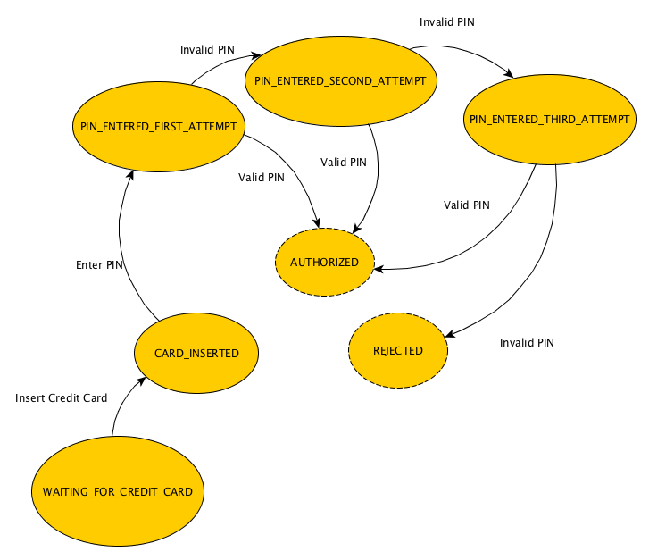
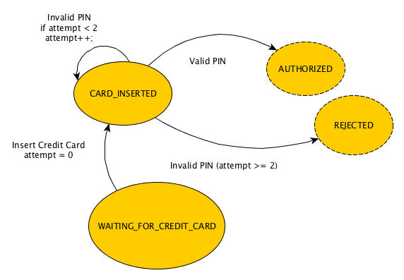

redux-saga-rxjs
=============

[![NPM version][npm-image]][npm-url]
[![Dependencies][dependencies]][npm-url]
[![Build status][travis-image]][travis-url]
[![Downloads][downloads-image]][downloads-url]


> RxJS implementation of [Saga pattern](https://www.youtube.com/watch?v=xDuwrtwYHu8) for [redux](https://github.com/reactjs/redux)

# This project is no longer updated and mantained, it was intended as proof of concept, there is a real library with awesome documentation & API, please have a look at [redux-observable](https://github.com/redux-observable/redux-observable).

## Introduction

### Redux is great, long running transactions are problematic
Redux gives us great power but with great power comes great responsibility. It's possible to build amazing, extensible, robust and scalable architecture, yet it's not as easy as it looks, because there are some unknowns which hasn't been fully solved and proven e.g. Local component State / Side effects / Long running transactions etc. One common problem that probably every developer will sooner or later have to face is communication with an API.

Reading through the Redux docs will guide you to use [`thunk-middleware`](https://github.com/gaearon/redux-thunk). Thunk middleware allows you to dispatch `function` instead of `object`, this is cool because the `function` gets called providing `dispatch` and `getState` as arguments, therefore it allows you to call the API inside the function and dispatch an action holding payload when API response arrives - this is an asynchronous operation.

```javascript

const apiAction = (dispatch, getState) => {
  dispatch({type: 'STARTED_LOADING_DATA'});

  api().then(response => dispatch({type: 'DATA_LOADED', response}));
}

const view = dispatch => (
  <button dispatch={() => dispatch(apiAction)}>Click to Load data</button>
);

```

The example above is something we could call long running transaction, in other words it's some kind of logic group which groups more than single Action. Long running transactions does not necessarily need to be Asynchronous, in this example the long running transaction is also asynchronous because those actions are not dispatched synchronously in sequence.


```javascript
const synchronousLongRunningTransaction = (dispatch, getState) => {
  dispatch({type: 'FOO'});

  if (getState().foo === 1) {
    dispatch({type: 'BAR'});
  }
}
```

The example above is also a long running transaction yet it's not asynchronous and does not yield any side effects.


### What is Saga pattern?
Saga is a pattern for orchestrating long running transactions... TODO

### Why is Saga good and probably mandatory for Redux?
Redux is just predictable state container. We can say that all it does (and it does very well) is holding refrence of your application state and providing interface to mutate it (dispatching actions) in single transaction. Whenever any action (interaction with the UI) is dispatched, the reducer is called with provided application state and action to perform the mutation. The simplest model of Redux is State Machine because it defines two concepts: States and Transitions where in context of Redux - States are references to application state snapshot in specific time and Transitions are Actions.

State Machine is missing one important piece and it's the transition history. State machine knows current state but it doesn't know anything about how it got to the state, it's missing **Sequence of transitions**. However, the Sequence of transitions is often very important information. Let's imagine you want to withdraw money from ATM, the first thing you need to do is enter your credit card and then enter the PIN. So the sequence of transitions could be as follows: `WAITING_FOR_CREDIT_CARD` -> `CARD_INSERTED` -> `AUTHORIZED` or `REJECTED` but we would like to allow user enter invalid PIN 3 times before rejecting.

So first naive approach would be model of State machine which covers all the possible states and transitions between them:



As you can see, for simple use case the State machine is quite complex, now let's have a look at the State machine which would probably correspond with the way you'd implemented it in Redux.



You might have spotted something ugly in the diagram and it's the counter of attempts in the form of intermediate state. Yes, in traditional Redux you'd have to keep the information in your application state because State Machine does not allow you to keep track of transitions history. And that's exactly the point where Saga comes into play.

**Long running transaction in context of Redux means specific sequence of dispatched actions**, without Saga there's no other way to know about the sequence but storing intermediate state in your application state.

```javascript
const reducer = (appState, { type }) {
  switch (type) {
    case 'VALID_PIN_ENTERED':
      return { ...appState, authorized: true };

    case 'PIN_REJECTED':
      if (appState.attempt >= 2) {
        return { ...appState, authFailure: true };
      } else {
        return { ...appState, attempt: appState.attempt + 1 };
      }

    default:
      return appState;
  }
}
```

However, using Saga we don't need to store the intermediate state in the application state and reducers because all this lives in Saga. **The reducer would be just a simple projector of your Domain Events (Actions), where the projection is application state**.

```javascript
const reducer = (appState, { type }) {
  switch (type) {
    case 'AUTHORIZED':
      return { ...appState, authorized: true };

    case 'REJECTED':
      return { ...appState, authFailure: true };

    default:
      return appState;
  }
}
```

## Comparison

### Is thunk-middleware Saga pattern?

[...TODO]

### What's the relation between Saga pattern and Side effects?

So why people say that Saga is a great pattern for Side effects? Let's take an API call as example - you'll probably have one action (`API_REQUESTED`) dispatched when user clicks the button to load data, which presumably displays loading spinner and another action to process the response (`API_FINISHED`) and this is all in single, long running transaction which Saga can handle.

We need to distinguish between Side effects and Asynchronous long running transaction. The former stands for some effect which is not the primary goal of the calling function (mutation of some external state / calling XHR / logging to console...) while the latter stands for asynchronous sequence of actions which is some logical group (transaction). Saga solves the latter, it's just an implementation detail that it's capable of solving side effects. We could still say that it should be forbidden to perform side effects in Sagas as it is in Reducers - just a minor implementation detail.

### Difference between redux-saga-rxjs and redux-saga

[...TODO]

## Usage

Install the package via `npm` - `npm install redux-saga-rxjs --save`. Package exposes single middleware to be used in your Redux application. The middleware takes Sagas as its arguments.

```javascript
import { createStore, applyMiddleware } from 'redux';
import sagaMiddleware from 'redux-saga-rxjs';

// Example of simplest saga
// Whenever action FOO kicks-in, Saga will dispatch
// BAR action
const saga = iterable => iterable
  .filter(({ action, state }) => action.type === 'FOO')
  .map(() => ({ type: 'BAR' }));

const storeFactory = applyMiddleware(
  sagaMiddleware(saga, sagaFoo...) // You can provide more than one Saga here
)(createStore);

// Very simple identity reducer which is not doing anything
const identityReducer = appState => appState;

// Use the store as you are used to in traditional Redux application
const store = storeFactory(identityReducer);
```

## Development

```
  npm install
  npm run test:watch
```


[npm-image]: https://img.shields.io/npm/v/redux-saga-rxjs.svg?style=flat-square
[npm-url]: https://npmjs.org/package/redux-saga-rxjs
[travis-image]: https://img.shields.io/travis/salsita/redux-saga-rxjs.svg?style=flat-square
[travis-url]: https://travis-ci.org/salsita/redux-saga-rxjs
[downloads-image]: http://img.shields.io/npm/dm/redux-saga-rxjs.svg?style=flat-square
[downloads-url]: https://npmjs.org/package/redux-saga-rxjs
[dependencies]: https://david-dm.org/salsita/redux-saga-rxjs.svg
